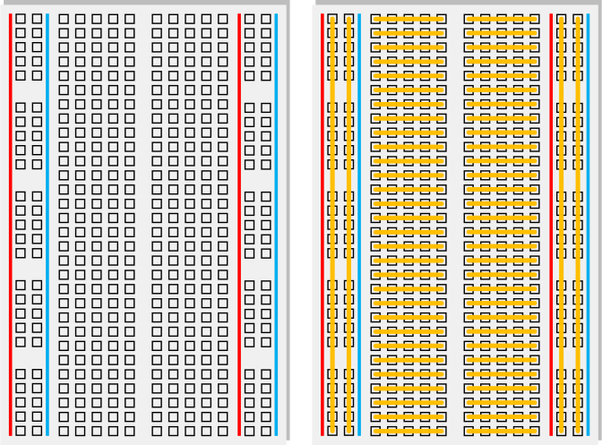
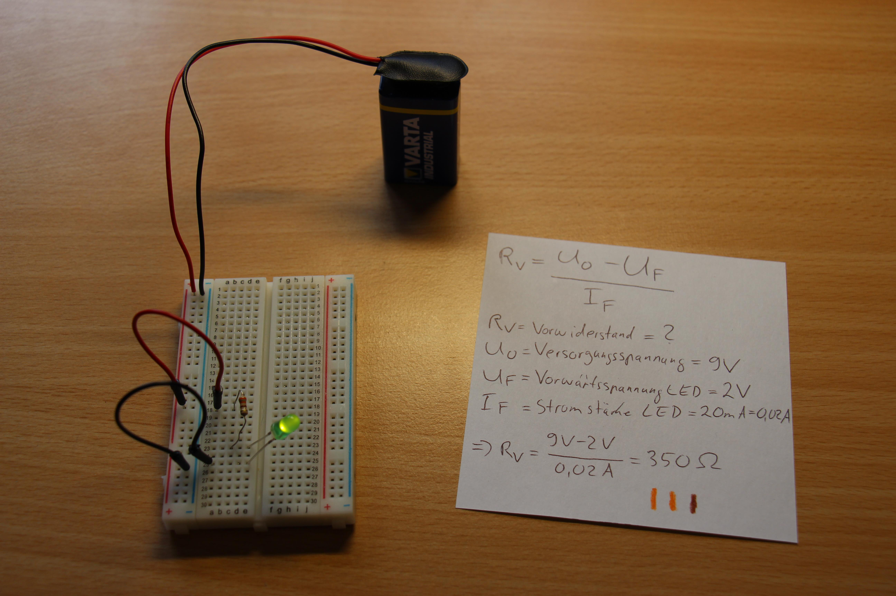
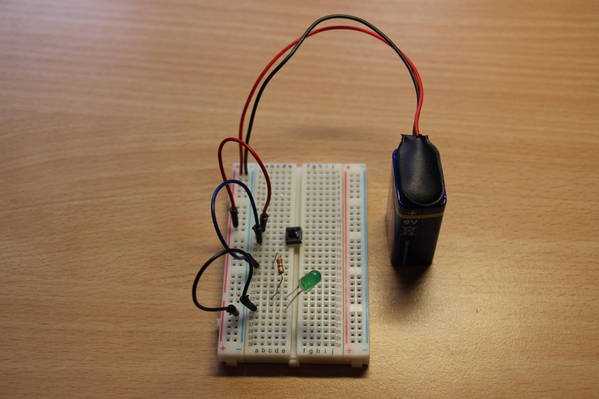
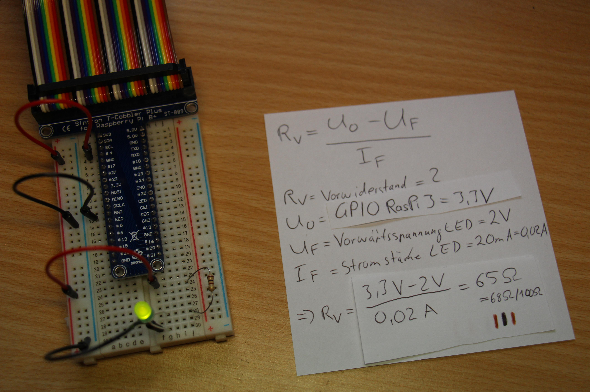
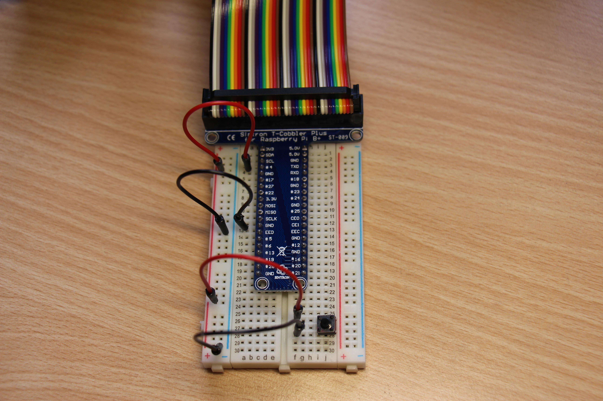
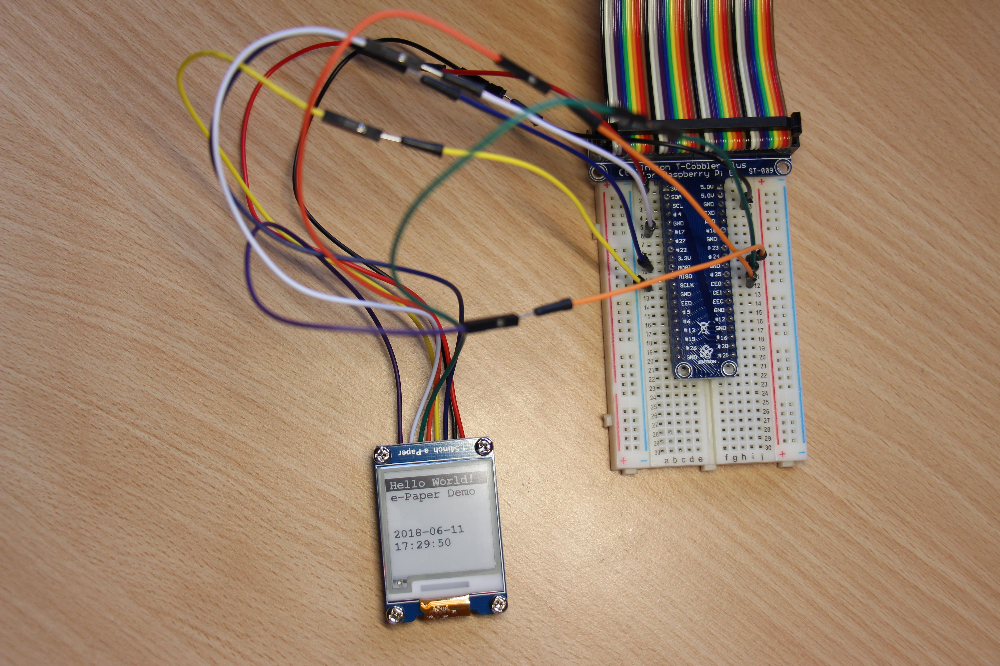
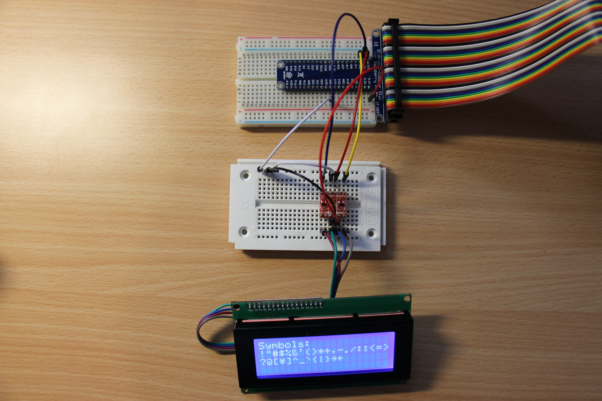

# RaspiForBeginners > GPIO

Control with python3 GPIO pins.


## 0. Sources with better explanation

- https://www.raspberrypi.org/documentation/usage/gpio/
- https://gpiozero.readthedocs.io/en/stable/recipes.html

## 1. Recap circuits

### Basic parts

#### Breadboard

A breadboard is simply a thing that helps you to easy make up circuits and change them without having to solder anything.



Your breadboard looks probably very similar. The openings that are connected via orange lines are really connected.

#### LED

A LED (light-emitting-diode) lights up when current runs through it at a specific voltage. If too much current runs through it, it dies which is why you often need resistors before one thus blocking some of the voltage. It also only let's light through in one direction which is why you need to check if it's in the right direction in the circuit (diode).

### Examples

#### Light up a LED



To find out the Ohm value of the resistor use the formula in the picture to not kill your LED, if you have a different battery/LED just paste your own values and recalculate the resistor value.

#### Light up a LED when a button is clicked



It's almost the same circuit than the one before but with an additional button. If you press the button down the LED will light up.

## 2. Basic GPIO usage cases

### Let current flow through a GPIO pin



If you build a circuit like this you have essentially connected your GPIO pin #4 to the LED circuit and grounded it at the end again at a pin.

To light up the LED execute the following code after installing the `gpiozero` package via python3 pip (`pip3 install gpiozero`).

[gpioDemoLed.py](scripts/gpio/gpioDemoLed.py)

```python
# import packages/modules
from gpiozero import LED
from time import sleep

# "Create" a LED at GPIO pin #4
led = LED(4)

# do the following infinitely
while True:
    print("led on")
    # turn the LED on
    led.on()
    # wait 4 seconds
    sleep(4)
    print("led off")
    # turn the LED off
    led.off()
    # wait 4 seconds
    sleep(4)
```

Execute the code with: `python3 gpioDemoLed.py` and your LED should light up and blink all 4 seconds.

### Recognize that a button was pressed



If you build a circuit like this you have essentially connected your GPIO pin #4 to a circuit that only contains a button that connects the grounded end of it to the pin #4 only when it is pressed down.

This means as soon as you press the button 3,3V from GPIO pin #4 will flow which can be recognized by the raspberry pi.

[gpioDemoButton.py](scripts/gpio/gpioDemoButton.py)

```python
# import packages/modules
from gpiozero import Button

# "Create" a button at GPIO pin #4
button = Button(4)

# do the following infinitely
while True:
    print("Wait for button to be pressed")
    # wait until the button is pressed
    button.wait_for_press()
    print("Button was pressed")
    button.wait_for_release()
    # wait until the button is released
```

Execute the code with: `python3 gpioDemoButton.py` and in the console you should read that the pi recognizes when you pressed the button and release it.

## 3. Advanced GPIO usage

### E-Ink display

- I bought this display: [Waveshare 1.54 Inch E-Paper Display](https://www.amazon.de/gp/product/B0728BJTZC/ref=oh_aui_detailpage_o01_s00?ie=UTF8&psc=1)
- I found the original code of how to use it [here](https://www.waveshare.com/wiki/1.54inch_e-Paper_Module)
- I found the python 'driver' [here](https://www.waveshare.com/wiki/File:1.54inch_e-Paper_Module_code.7z)

The edited version of the driver which was modified so that it ran for me is [here](scripts/gpio/e-Ink)



If you connect all pins like the [readme.txt](scripts/gpio/e-Ink/readme.txt) says or the picture displays you can either execute the [original demo](scripts/gpio/e-Ink/main.py) or one of the simplified scripts to display [text](scripts/gpio/e-Ink/custom_main_text.py) or a [picture](scripts/gpio/e-Ink/custom_main_picture.py) via python3 (you need to copy the whole directory to your pi to execute any of the main files).

---

- To use the display you need to enable SPI in `raspi-config` (or the GUI system settings)!
  - Do it via `sudo raspi-config` > `5. Interface Options` > `P4 SPI` > `True`
- If you do not already have pillow installed install it via `pip3 install Pillow`.

---

### LCD (Display)

- I bought this display: [SunFounder IIC/I2C/TWI Serial 2004/20x4 LCD Display](https://www.amazon.de/gp/product/B01GPUMP9C/ref=oh_aui_detailpage_o01_s01?ie=UTF8&psc=1)
- Then I followed the great instructions of [this website](https://tutorials-raspberrypi.de/hd44780-lcd-display-per-i2c-mit-dem-raspberry-pi-ansteuern/), Go over there if you can speak German - it's a really great tutorial
- From the same page I also got a [python driver](http://tutorials-raspberrypi.de/wp-content/uploads/scripts/hd44780_i2c.zip) for the display
- To get everything to work because of the I2C adapter I followed the tutorial and additonally bought [2 Channel Logic Level Converter 3.3V to 5V ](https://www.amazon.de/gp/product/B06Y3FNGJF/ref=od_aui_detailpages00?ie=UTF8&psc=1) 

I copied the driver into this repository if in the future the other site dissapears or changes it's link system, but please give the article a try, I really liked it and could instantly start.



If you connect all pins like their [article](https://tutorials-raspberrypi.de/hd44780-lcd-display-per-i2c-mit-dem-raspberry-pi-ansteuern/) says ([they even have a great picture](https://tutorials-raspberrypi.de/wp-content/uploads/hd44780-i2c-display_Steckplatine-600x365.png)) or like the picture above displays you need to do two more things:

---

- To use the display you need to enable I2C in `raspi-config` (or the GUI system settings)!
  - Do it via `sudo raspi-config` > `5. Interface Options` > `P5 I2C` > `True`
  - To check if everything worked just enter `sudo i2cdetect -y 1` and you should see a table where a 27 is listed (if there is another number listed change the address in the [`lcddriver.py`](scripts/gpio/lcd/lcddriver.py) file to the new address from `ADDRESS = 0x27 `)

---

Now you need to copy the entire directory [lcd](scripts/gpio/lcd) onto your pi, open in the cloned/copied directory your terminal and execute [`main.py`](scripts/gpio/lcd/main.py). If everything worked you can now implement your methods and do what you want with it.